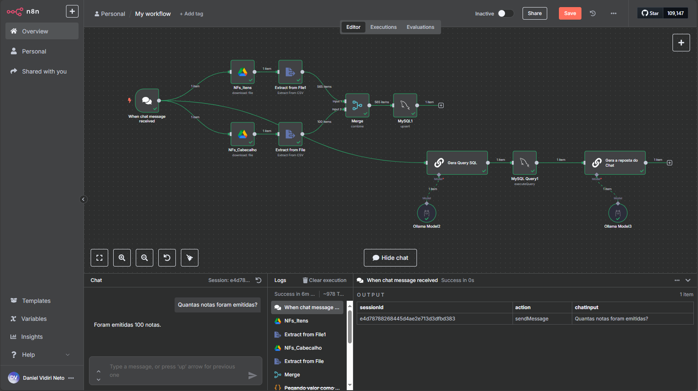

# 
I2A2 & MetadataH

## 
Curso de Agentes Autônomos

### Repositório com os arquivos do challenge de Agente IA que analisa notas fiscais no formato CSV.

---

## **Tecnologias Utilizadas:**

  
  &nbsp;&nbsp;
  
  &nbsp;&nbsp;
  
  &nbsp;&nbsp;
  
  &nbsp;&nbsp;
  
  &nbsp;&nbsp;

## Sobre as Ferramentas Utilizadas

:heavy_check_mark: <b>n8n</b> 
:heavy_check_mark: <b>Ollama</b> 
:heavy_check_mark: <b>Mistral AI 7B</b> 
:heavy_check_mark: <b>Docker</b> 
:heavy_check_mark: <b>MySQL</b> 

---

## **TEMA**   Análise de Notas Fiscais em CSV por Agente de IA

## Objetivo do Projeto

#### Desenvolver um agente de IA que analisa as notas fiscais no formato CSV e responda as perguntas feitas pelo usuário:

## Como Utilizar

1 - Ter uma conta no n8n (cloud ou desktop) para poder importar o projeto que está no formato JSON.  
2 - Para esse projeto, o n8n foi instalado dentro de um docker.  
3 - Ter uma IA para anexar ao projeto. Para esse projeto foi utilizado o Ollama localmente com a IA Mistral 7B.  
4 - Ter um banco de dados para anexar ao projeto. Para esse projeto foi utilizado o MySQL.  
5 - Tem um arquivo aqui com o diagrama da tabela de Notas Fiscais que deve ser criado no MySQL.  
6 - As planilhas CSV estão dentro de uma pasta no Google Drive.  
7 - Criar as credenciais dentro do n8n para acessar o Google Drive, o Ollama (ou API da sua IA) e o MySQL.

---

## :handshake: **EQUIPE**

<b>Este projeto foi elaborado por:</b>

| Perfil                                                                                                            | Nome e Email                                   | Localização | Github                                                                                                                                                                           | Linkedin                                                                                                                                               |
| ----------------------------------------------------------------------------------------------------------------- | ---------------------------------------------- | ----------- | -------------------------------------------------------------------------------------------------------------------------------------------------------------------------------- | ------------------------------------------------------------------------------------------------------------------------------------------------------ |
|  | `Daniel Vidiri Neto`  dvn.face@gmail.com | Araras - SP |  |  |

---

## Agradecimentos

- I2A2;
- MetadataH;

---

---

  

